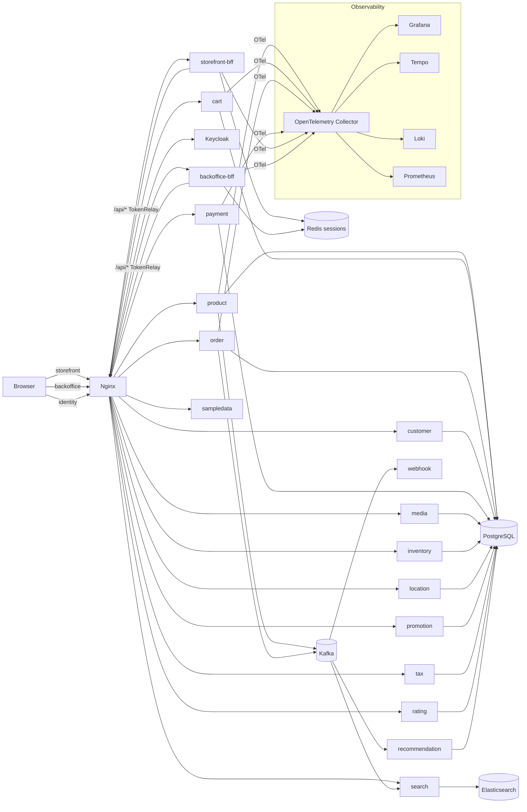
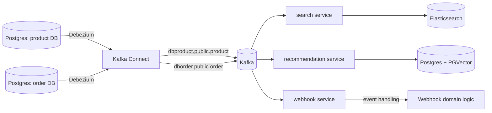
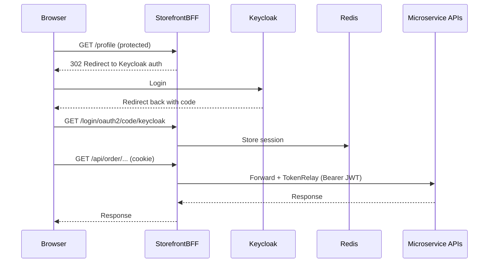
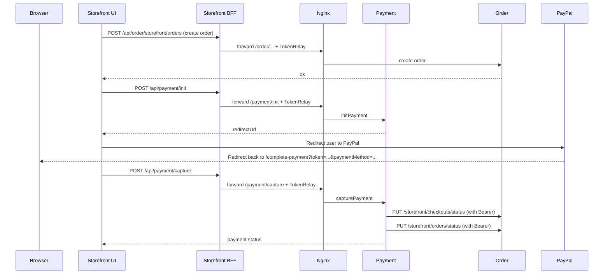

# YAS — Repository Overview

This document complements the root `README.md` and `docs/README.md` by summarizing the codebase from three perspectives:

- **Software Architect**: topology, service boundaries, runtime/deployment, scalability concerns.
- **Software Developer**: repo structure, patterns, key libraries, maintainability hot-spots.
- **Product Manager**: main features and end-to-end user flows (storefront + backoffice).

> Scope note: This overview is based on configuration and code paths verified in this repository (Docker Compose, Kubernetes manifests, Spring Boot modules, and selected UI pages/services). Where the repo contains multiple variants (e.g., different Nginx templates, `application.properties` vs `application-prod.properties`), this document calls that out.

---

## 1) Executive Summary

- **Architecture**: Microservices + **BFF (Backend-for-Frontend)** for two UIs: `storefront` and `backoffice`.
- **Backend stack**: Java 21, Spring Boot (multi-module Maven build), Spring Security (OAuth2), Spring Cloud Gateway (BFF).
- **Frontend stack**: Next.js (React) for both UIs.
- **Auth**: Keycloak (OIDC). BFFs perform login and relay access tokens to downstream APIs.
- **Data**:
  - PostgreSQL with **one database per service** (created by `postgres_init.sql`).
  - Redis for BFF session storage.
  - Elasticsearch for search indexing.
  - Kafka + Debezium for CDC/event-driven projections.
- **Observability**: OpenTelemetry instrumentation (Java agent) → OpenTelemetry Collector → Tempo/Loki/Prometheus → Grafana.

---

## 2) Repository Layout (What lives where)

### Core runtime & infra

- `docker-compose.yml`, `docker-compose.search.yml`, `docker-compose.o11y.yml`, `.env`
- `nginx/templates/default.conf.template` (active Nginx template)
- `nginx/templates/default-backup` (alternate template with more routes enabled)
- `kafka/connects/*.json` (Debezium connector configs)
- `k8s/` (Helm charts + deploy scripts)

### Applications

- **BFFs**
  - `storefront-bff/` (Spring Cloud Gateway + OAuth2 client)
  - `backoffice-bff/` (Spring Cloud Gateway + OAuth2 client)
- **UIs**
  - `storefront-ui/` (Next.js)
  - `backoffice-ui/` (Next.js)
- **Domain microservices** (Spring Boot)
  - `product/`, `cart/`, `order/`, `customer/`, `inventory/`, `media/`, `location/`, `promotion/`, `tax/`, `rating/`, `search/`, `payment/`, `webhook/`, `recommendation/`, `sampledata/`, `delivery/`
- **Shared library**
  - `common-library/` (exceptions, Kafka CDC helpers, CORS config, etc.)
- **Automation / E2E tests**
  - `automation-ui/` (Selenium + Cucumber-based UI automation)

---

## 3) How Requests Flow (Nginx + BFF + Microservices)

### Hostname routing

In the **Docker Compose** setup, traffic typically enters via Nginx and is routed by hostname:

- `http://storefront/...` → `storefront-bff` → `storefront-ui` or API
- `http://backoffice/...` → `backoffice-bff` → `backoffice-ui` or API
- `http://identity/...` → Keycloak
- `http://api.yas.local/<service>/...` → Nginx path routing → corresponding microservice

### BFF routing rules (production profile)

Both BFFs define a gateway route:

- `/api/**` → `http://nginx` with `TokenRelay` and `StripPrefix=1`
- `/**` → the UI container

This means frontends call `fetch('/api/...')` and the BFF forwards those calls to Nginx, which then dispatches to the correct microservice based on the path.

### Important note: Nginx template inconsistency

- `nginx/templates/default.conf.template` has several `api.yas.local` routes commented out (e.g., `/payment/`, `/promotion/`, `/tax/`, `/location/`, `/rating/`, `/webhook/`, `/recommendation/`).
- `nginx/templates/default-backup` contains those routes enabled.

This is a **deployment risk**: the storefront/backoffice apps make API calls like `/api/payment/...` (see `storefront-ui/modules/paymentPaypal/services/PaymentPaypalService.ts`), which require Nginx to route `/payment/` correctly.

---

## 4) High-Level Architecture (Software Architect)

### 4.1 System context

### 4.2 Data ownership

The repository follows a **database-per-service** pattern. `postgres_init.sql` creates databases like:

- `product`, `cart`, `order`, `customer`, `inventory`, `promotion`, `tax`, `rating`, `payment`, `media`, `location`, `webhook`, `recommendation`, plus `keycloak`.

This supports service autonomy and enables CDC/event sourcing patterns.

### 4.3 Eventing / CDC

Debezium connectors (`kafka/connects/*.json`) stream DB changes into Kafka topics:

- Product CDC topic: `dbproduct.public.product`
- Order CDC topic: `dborder.public.order`

These topics drive:

- `search` → Elasticsearch projection (product search)
- `recommendation` → PGVector projection (embedding-based search)
- `webhook` → consumes product/order events

### 4.4 Observability

- Services are configured to run with the `opentelemetry-javaagent.jar` (via `.env` `JAVA_TOOL_OPTIONS`).
- `docker-compose.o11y.yml` sets up:
  - OpenTelemetry Collector
  - Grafana
  - Prometheus
  - Loki
  - Tempo

---

## 5) Authentication & Authorization

### 5.1 BFF-based login (OIDC)

- Keycloak is the Identity Provider (realm: `Yas`).
- `storefront-bff` and `backoffice-bff` are **OAuth2 clients**.
- After login, the BFF maintains a session (Redis) and uses `TokenRelay` to forward access tokens to backend APIs.

### 5.2 Resource server enforcement

Most domain services are configured as **OAuth2 resource servers** and enforce authorization by path:

- `/storefront/**` is often public or customer-level
- `/backoffice/**` generally requires `ADMIN`

Example (pattern observed across multiple modules):

- `product`: `/storefront/**` permitted; `/backoffice/**` requires `ADMIN`
- `cart`: `/storefront/carts/**` requires `CUSTOMER`

**Open question / risk**: many services define a `JwtAuthenticationConverter` for Keycloak realm roles, but do not visibly attach it to the resource server configuration. If role mapping is not applied, role-based checks may not behave as intended.

---

## 6) Service Catalog (What each service does)

> Ports/paths vary between local runs and Docker Compose. In Compose, many services receive `SERVER_PORT=80` from `.env`, and Nginx proxies to them by container name.

### BFF + UI

- **storefront**
  - UI: `storefront-ui` (Next.js)
  - BFF: `storefront-bff` (Spring Cloud Gateway, OAuth2 login)
  - Example UI API call pattern: `fetch('/api/...')`
- **backoffice**
  - UI: `backoffice-ui` (Next.js)
  - BFF: `backoffice-bff` (Spring Cloud Gateway, OAuth2 login)

### Domain services (selected)

- **product**: catalogs, brands, categories, attributes; storefront + backoffice endpoints in controllers.
- **cart**: customer cart endpoints.
- **order**: checkout + order creation; backoffice order listing/export.
- **payment**: payment init/capture, provider catalog (storefront) + provider admin (backoffice).
- **search**: consumes product CDC and indexes into Elasticsearch; exposes `/search/...` endpoints.
- **recommendation**: consumes product CDC and stores embeddings in PGVector; integrates with Azure OpenAI (config-driven).
- **webhook**: consumes Kafka product + order events.

---

## 7) Key User Flows (Product Manager View)

### 7.1 Storefront

What is clearly implemented/visible from the repo:

- **Home page**: banner, categories, featured products (`storefront-ui/pages/index.tsx`).
- **Checkout** (storefront UI):
  - Fetch checkout by id: `GET /storefront/checkouts/{id}` (order service)
  - Create order: `POST /storefront/orders` (order service)
  - Payment selection uses enabled providers: `GET /storefront/payment-providers` (payment service)
  - PayPal payment initiation: `POST /payment/init` (payment service)
  - PayPal capture: `POST /payment/capture` (payment service)

Payment flow (as implemented in UI + services):

### 7.2 Backoffice

Visible capabilities from API patterns and UI structure:

- **Product management**: create/update/delete products, brands, categories, attributes (product service `backoffice/*`).
- **Order management**: list orders, get details, export CSV (`order` service `backoffice/*`).
- **Payment providers management**: create/update providers (`payment` service `backoffice/payment-providers`).

---

## 8) Developer Notes (Maintainability & Patterns)

### 8.1 Monorepo build

- Root `pom.xml` defines a multi-module build across all services.
- Most services are Spring Boot apps with:
  - Liquibase for schema changes
  - Resource-server security
  - `RestClient` for inter-service calls

### 8.2 Common-library usage

`common-library/` provides shared infrastructure:

- **Exceptions + global handler**: `ApiExceptionHandler`
- **Kafka CDC helpers**: `BaseCdcConsumer`, typed listener factory base config, and a retry/DLQ annotation (`@RetrySupportDql`).
- **CORS config**: `CorsConfig` reads `cors.allowed-origins`.

### 8.3 Resilience

- `resilience4j` is used for REST calls (example: payment → order updates on capture).

### 8.4 CI/CD & quality

- `.github/workflows/` includes per-module CI pipelines.
- Root Maven build includes plugins for security/dependency checking and quality gates (e.g., OWASP dependency check, Checkstyle, JaCoCo).

---

## 9) Risks, Gaps, and Questions (Actionable)

### Routing & deployment

- **Nginx `default.conf.template` vs `default-backup` mismatch**
  - Action: decide which one is canonical and ensure all required `/api.yas.local/<service>/` routes are enabled.

### Security

- **Role mapping converter not obviously applied**
  - Action: verify JWT roles from Keycloak (`realm_access.roles`) are mapped in Spring Security for all resource servers.

### Service packaging

- **`payment-paypal` appears to be a library module, not a deployable service**
  - Action: clarify whether it should be deployed separately; align `.env` swagger URLs and docs accordingly.

### Config consistency

- **CORS configuration**
  - Action: confirm whether multiple origins are expected; if so, implement comma-separated handling.

### Feature completeness

- **`delivery` service is currently a stub**
  - Action: decide whether to remove, implement, or mark explicitly as placeholder.

- **`webhook` and `recommendation` are present in the Maven reactor but commented out in `docker-compose.yml`**
  - Action: confirm if they are intended to run in local Compose by default.

---

## 10) Where to Look Next

- **Architecture narrative**: `docs/README.md`
- **Dev guidelines**: `docs/developer-guidelines.md`
- **Nginx routing**: `nginx/templates/default.conf.template`
- **Docker runtime**: `docker-compose*.yml` and `.env`
- **Keycloak realm setup**: `identity/realm-export.json` and Helm Keycloak import template

---

## Status

- This `OVERVIEW.md` was created as a starting point for onboarding and ongoing architecture/product discussion.
- Next iteration can expand:
  - a complete endpoint inventory per service,
  - a full product feature map (storefront + backoffice),
  - and a “known-good local run” checklist validated against current `docker-compose` + Nginx template.
