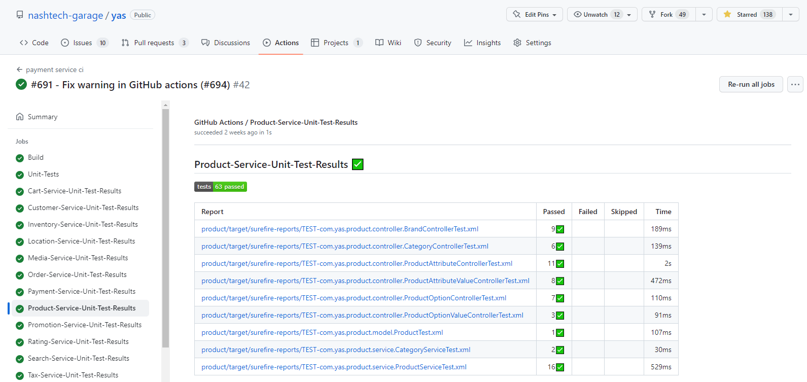
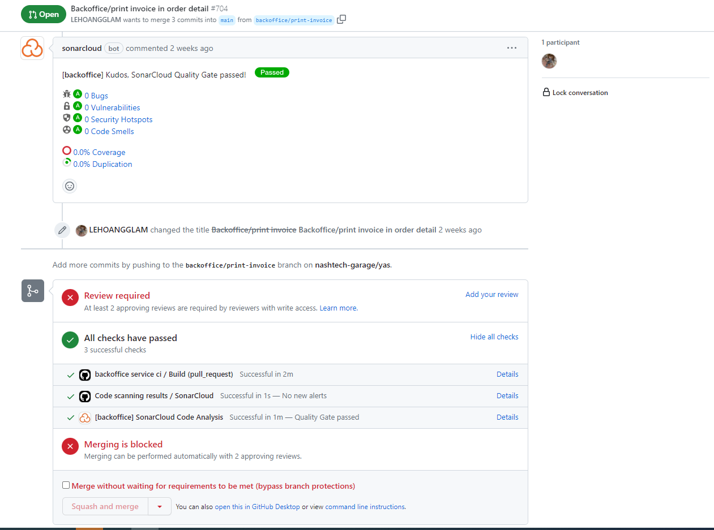
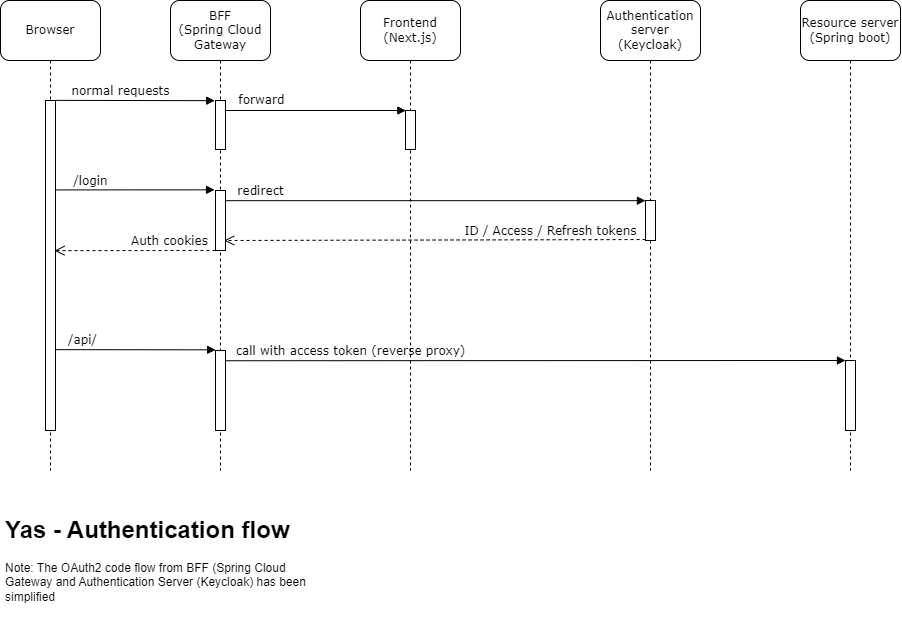

# YAS: Yet Another Shop
YAS is a pet project aim to practice building a typical microservice application in Java
https://github.com/nashtech-garage/yas

##Table of Contents

- [Repo setup](#repo-setup)
- [Continous Interation](#continous-interation)
- [Authentication and Authorization](#authentication-and-authorization)
- [Change Data Capture (CDC) with Debezium](#change-data-capture-cdc-with-debezium)
- [Product searching with Elasticsearch](#product-searching-with-elasticsearch)
- [Duplicating data to improve performance](#duplicating-data-to-improve-performance)
- [Saga pattern](#saga-pattern)
- [Observability](#observability)
- [Frontend architecture](#frontend-architecture)
- [Local development with docker compose](#local-development-with-docker-compose)
- [Kubernetes](#kubernetes)

## Repo setup

Entire the source code of Yas project is hosted publicly in GitHub as a monorepo and the source code of each micro-services are put in its own folder. Generally, there are two ways to organize the source code for microservices projects: multi-repos and monorepo. Multi-repos means that there are multiple repositories to host the project, each micro-service hosted in its own repo. We chose monorepo for simplicity, by this way we can have only one issue tracker to watch for entire the project. Some features or bugs require code change in multiple micro-services, with monorepo we can create one commit that can span multiple micro-services. The code is visible to everyone, so we don’t have the need of a separate access control for each micro-service.

## Continous Interation

In Yas, we use GitHub Actions, which are totally free for open-source project, to build the continuous integration pipeline. All the GitHub Actions workflows are put in `/.github/workflows` folder. Each micro-services will have its own workflow. Let look at the first part of the typical workflow: product

```yaml
name: product service ci

on:
  push:
    branches: [ "main" ]
    paths:
      - "product/**"
      - ".github/workflows/actions/action.yaml"
      - ".github/workflows/product-ci.yaml"
  pull_request:
    branches: [ "main" ]
    paths:
      - "product/**"
      - ".github/workflows/actions/action.yaml"
      - ".github/workflows/product-ci.yaml"
      
  workflow_dispatch:
```

We use the `on` keyword to specify what event will trigger our workflow. Here we trigger the workflow when there are pushes to the main branch. As we organized the project in a single monorepo, we need to specify the paths, the workflow only run when there are changes in that paths. That mean developers push code to the order folders doesn’t trigger the workflow of the product. Next, we also would like to run the workflows in the pull requests to make sure the code changes in pull request pass all the requirement before being merged. Finally, with `workflow_dispatch` we allow the workflow can be trigger manually in GitHub UI.

Next, we will define jobs in our workflow. One GitHub Actions workflow can contain many jobs which run parallel by default. Each job runs inside its own virtual machine (runner) specified by `run-on`. In our case we only need one job. In the job we can have many steps. Each step is either a shell script or an action. Steps are executed in order and are dependent on each other. Since each step is executed on the same runner, you can share data from one step to another. For example, you can have a step that builds your application followed by a step that tests the application that was built.

```yaml
jobs:
  Build:
    runs-on: ubuntu-latest
    steps:
      - uses: actions/checkout@v3
        with:
          fetch-depth: 0  # Shallow clones should be disabled for a better relevancy of analysis
      - uses: ./.github/workflows/actions
      - name: Run Maven Build Command
        run: mvn clean install -DskipTests -f product
      - name: Run Maven Test
        run: mvn test -f product
      - name: Unit Test Results
        uses: dorny/test-reporter@v1
        if: success() || failure()
        with:
          name: Product-Service-Unit-Test-Results
          path: "product/**/surefire-reports/*.xml"
          reporter: java-junit
      - name: Analyze with sonar cloud
        if: ${{ github.event.pull_request.head.repo.full_name == github.repository || github.ref == 'refs/heads/main' }}
        env:
          SONAR_TOKEN: ${{ secrets.SONAR_TOKEN }}
        run: mvn org.sonarsource.scanner.maven:sonar-maven-plugin:sonar -f product
      - name: Log in to the Container registry
        if: ${{ github.ref == 'refs/heads/main' }}
        uses: docker/login-action@v2
        with:
          registry: ghcr.io
          username: ${{ github.actor }}
          password: ${{ secrets.GITHUB_TOKEN }}
      - name: Build and push Docker images
        if: ${{ github.ref == 'refs/heads/main' }}
        uses: docker/build-push-action@v3
        with:
          context: ./product
          push: true
          tags: ghcr.io/nashtech-garage/yas-product:latest
```

The first step in our workflow is checkout the source code. This is done by using the action `actions/checkout` version 3. The next steps we reuse some actions defined in the https://github.com/nashtech-garage/yas/blob/main/.github/workflows/actions/action.yaml file which will setup Java SDK 17 and some caches to improve the build time. We build the source code by run Maven command; run test, and export test result to be showed in the UI. There is a limitation that if there are many GitHub Action workflows are triggered by one git push, the test report is showed only in the first workflow. The issue is reported here https://github.com/dorny/test-reporter/issues/67




We use SonarCloud to analyze the source code. SonarCloud is free for open-source projects. To authenticate with SonarCloud, we will need the SONAR_TOKEN. After register an account on SonarCloud and add our GitHub repo to SonarCloud, we can get the SONAR_TOKEN. This SONAR_TOKEN needs to be added to repository secret in GitHub. In the repository, go to Settings –> Security –> Secrets and variables –> Actions and add new repository secret. Because the security reason, the SONAR_TOKEN is not available in pull requests from forked repos. We added the `if:` statement so that this step only run on the main branch or pull requests created from within our repo not from a fork. The SonarCloud bot will add the scanning report to every pull request as image below.




The final steps are login to GitHub Packages, build and push the docker image to there. We only build and push docker image when the workflow is run in the main branch not on pull requests.

To improve the code quality of the project, we have configured that every pull request needs to pass certain conditions: build success, pass sonar gate and have at least 2 developers review and approved, otherwise the Merge button will be blocked.

## Authentication and Authorization

Authentication is hard. Many developers have been struggling to find better ways to secure the browser-based application, especially with SPAs. Traditionally, websites use cookies to authenticate user requests, then with SPAs people moved to using token for authentication. Let’s review how the cookies and token authentication works and the differences between them

#### Cookies-based authentication

Cookies are small pieces of data created by a web server and placed on the user’s web browser. The browser will automatically send them for subsequence requests in the same domain. Authentication cookies are used by web servers to authenticate that a user is logged in.

##### The advantages

- Cookies are managed by the browser. It is automatic
- You can prevent client JavaScript to read them by setting the HttpOnly flag to true. This will prevent cross-site scripting (XSS) attacks on your application to steal them or manipulate them

##### The downside

- It is vulnerable to cross-site request forgery attacks (XSRF or CSRF). Although there are workarounds to mitigate this threat, the risk still there. Recently the major browsers have introduced SameSite attribute that allow us to decide whether cookies should be sent to third-party websites using the Strict or Lax setting.
- Cookies is not friendly with REST APIs

#### Token-based authentication

The web browser will receive a token from the web server after it has verified the user’s login detail. Then in subsequent requests, that token will be sent to server as an authentication header.

##### The advantages

- Unlike cookies, token is not automatically received or sent to server. It has to be done by JavaScript. Therefore, it is invulnerable to cross-site request forgery attacks (CSRF)
- Token is friendly with REST APIs

##### The disadvantages

- Because the token must be read and sent by JavaScript so it is vulnerable to cross-site scripting (XSS)
- Granting, storing and renewing token is complicated. In 2012 when the OAuth2 RFC was released, the implicit flow is the recommended way for SPAs. However, it has many drawbacks, the main concern is that the access token is delivered to browser via a query string in the redirect URI, which is visible in the browser’s address bar, the browsers history. The access token can also be maliciously injected. The implicit flow is deprecated by code flow with PKCE. Regarding to any approaches, the token has to be stored in the browser, and this is a risk.

In Yas, we use SameSite cookies and token together with backend for frontend (BFF) pattern with Spring Cloud Gateway. We also use Keycloak as the authentication provider.



The BFF work as a reverse proxy for both Next.js and resource servers behind. The authentication between Browser and BFF is done by cookies. The BFF takes the OAuth2 client role and authenticate with Keycloak by OAuth2 code flow using spring-boot-starter-oauth2-client. When received the access token, BFF keeps it in memory and automatically append it along with api requests to resource servers. With this implementation, we can take out the risk of storing token in the browsers. Renewing tokens also handled automatically by the OAuth2 client. Below is the excerpt of the pom.xml of the backoffice-bff

```xml
<dependency>
	<groupId>org.springframework.cloud</groupId>
	<artifactId>spring-cloud-starter-gateway</artifactId>
</dependency>
<dependency>
	<groupId>org.springframework.boot</groupId>
	<artifactId>spring-boot-starter-oauth2-client</artifactId>
</dependency>
```
And this is the Spring Cloud configuration

```yaml
spring:
  application:
    name: backoffice-bff
  security:
    oauth2:
      client:
        provider:
          keycloak:
            issuer-uri: http://identity/realms/Yas
        registration:
          api-client:
            provider: keycloak
            client-id: backoffice-bff
            client-secret: ********************
            scope: openid, profile, email, roles
  cloud:
    gateway:
      routes:
        - id: api
          uri: http://api.yas.local
          predicates:
            - Path=/api/**
          filters:
            - RewritePath=/api/(?<segment>.*), /$\{segment}
            - TokenRelay=
        - id: nextjs
          uri: http://localhost:3000
          predicates:
            - Path=/**
```

## Change Data Capture (CDC) with Debezium

## Product searching with Elasticsearch

## Duplicating data to improve performance

## Saga pattern

## Observability

## Frontend architecture 

## Local development with docker compose

## Kubernetes